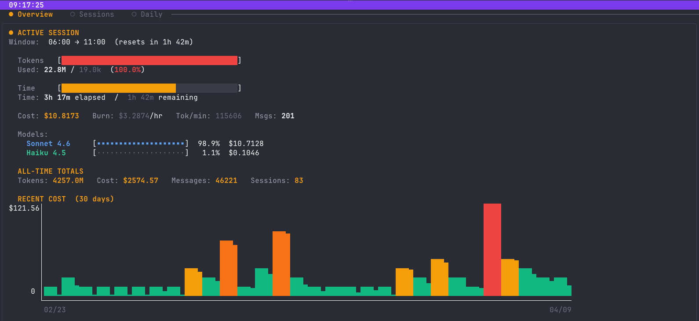
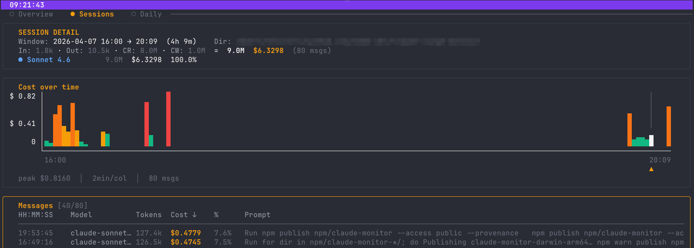
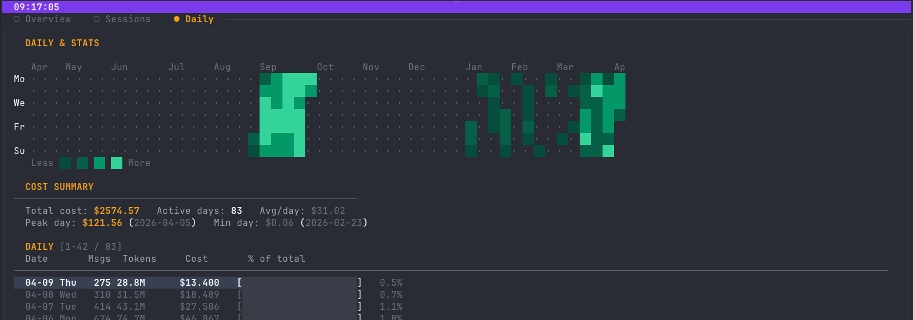

# claude-top

Terminal UI for monitoring [Claude Code](https://claude.ai/code) and [Codex CLI](https://github.com/openai/codex) token and cost usage in real time.

## Screenshots





## Features

- **Overview** — active session progress bar, burn rate, time remaining; per-source stats when using `--source all`
- **Sessions** — sortable history table with `[C]`/`[X]` source badges, source filter toggles, sessions grouped per project (CWD+source), drill into any session for per-message cost breakdown
- **Daily** — 52-week contribution graph, cost summary, scrollable per-day table
- **Monthly** — per-month aggregation with cost trend, token totals, and active-day count
- **Message Detail** — full user prompt, tool calls & results, assistant response loaded on demand (Claude Code sessions)
- **Codex CLI support** — reads `~/.codex/sessions`, calculates cost from OpenAI pricing
- **Leaderboard upload** — compete globally at [claude-top.a2d2.dev](https://claude-top.a2d2.dev); Claude Code and Codex CLI tracked on separate leaderboards, per-source rank shown on success
- **Self-update** — `claude-top update` downloads the latest release with progress bar
- Chart highlights the selected message's position in time with intermediate X-axis ticks and cross-midnight date labels
- Auto-refreshes every 10 seconds; press `r` to force refresh

## Installation

### npx (no install required)

```bash
npx @a2d2/claude-top@latest
```

### npm global

```bash
npm install -g @a2d2/claude-top
claude-top
```

### go install

```bash
go install github.com/a2d2-dev/claude-top@latest
```

### Download binary

Grab the binary for your platform from the [Releases page](https://github.com/a2d2-dev/claude-top/releases/latest):

| Platform | File |
|----------|------|
| macOS Apple Silicon | `claude-top-darwin-arm64` |
| macOS Intel | `claude-top-darwin-x86_64` |
| Linux x64 | `claude-top-linux-x86_64` |
| Linux ARM64 | `claude-top-linux-arm64` |
| Windows x64 | `claude-top-windows-x86_64.exe` |

```bash
# macOS / Linux
chmod +x claude-top-*
./claude-top-darwin-arm64
```

## Usage

```
claude-top [flags]
claude-top update    # download and install the latest release
claude-top version   # print the current version

Flags:
  --claude-path  Path to Claude projects dir                (default: ~/.claude/projects)
  --source       Data source: all, claude, or codex         (default: all)
  --codex-path   Path to Codex CLI sessions dir             (default: ~/.codex/sessions)
```

Subscription plan (pro / max5 / max20) is configured inside the TUI — press `,` or `o` to open settings.

### Examples

```bash
# Show both Claude Code and Codex CLI usage (default)
claude-top

# Show only Claude Code
claude-top --source claude

# Show only Codex CLI
claude-top --source codex
```

## Keyboard shortcuts

| Key | Action |
|-----|--------|
| `1` / `2` / `3` / `4` | Switch tabs (Overview / Sessions / Daily / Monthly) |
| `Tab` / `Shift+Tab` | Cycle tabs |
| `↑` / `↓` or `k` / `j` | Move cursor |
| `PgUp` / `PgDn` | Page up / down (Sessions) |
| `g` / `G` | Jump to top / bottom |
| `Enter` | Open session / message detail |
| `Esc` | Back |
| `s` / `S` | Cycle sort column forward / backward |
| `/` | Toggle sort direction |
| `r` | Force refresh |
| `u` | Upload stats to global leaderboard |
| `,` / `o` | Open settings |
| `q` | Quit |

## Leaderboard

Upload your monthly stats to compete globally at [claude-top.a2d2.dev](https://claude-top.a2d2.dev).

- Press `u` in the TUI to authenticate with GitHub and upload
- Claude Code and Codex CLI stats are tracked on separate leaderboards
- Only aggregated token counts and costs are uploaded — no prompts, file paths, or session content

## Changelog

### v0.4.0

- **feat(monthly)**: New Monthly tab — per-month aggregation with cost trend, token totals, and active-day count

### v0.3.2

- **feat(update)**: `claude-top update` self-updates to the latest release with a download progress bar
- **fix(sessions)**: Group sessions by project (CWD+source) independently — Claude and Codex sessions in the same directory no longer collide
- **fix(sessions)**: Show active (in-progress) blocks in the Sessions list

### v0.3.0

- **feat**: Codex exec-mode warning, Plan setting in the TUI settings panel, `--claude-path` flag (renamed from `--data-path`)
- **perf**: Added benchmark suite and fixed CPU saturation on large session sets

### v0.2.2

- **fix(codex)**: Fixed Codex CLI cost calculation — OpenAI's `input_tokens` includes cached tokens (unlike Anthropic), causing cached tokens to be double-billed at both input and cache-read rates. Heavy Codex users with high cache hit rates (>90%) saw costs inflated by ~3-4x.

### v0.2.1

- **fix(npm)**: Added sibling-path fallback in launcher to fix Windows npx failure

### v0.2.0

- **feat**: Added Codex CLI support (`--source codex`), separate leaderboards per source
- **feat**: Flattened tab structure — Claude Code / Codex CLI / About as single-level tabs
- **feat**: Upload API versioning + per-source rank display on success

## Requirements

Claude Code stores session data in `~/.claude/projects/`. Codex CLI stores session data in `~/.codex/sessions/`. Both are read directly — no network access required for local monitoring.

## License

MIT
